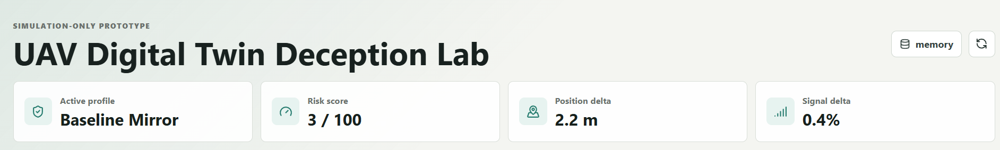
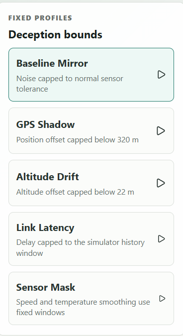
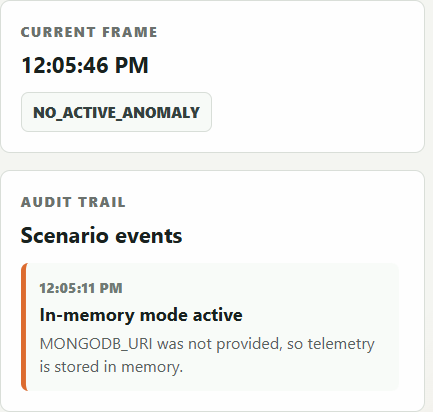

# UAV Digital Twin Deception Lab

A safe, browser-based prototype for demonstrating a bounded UAV digital-twin deception concept. It simulates trusted UAV telemetry, creates a fixed-profile decoy twin, compares the difference, and logs scenario activity.

This project is intentionally simulation-only. It does not connect to flight controllers, real UAV telemetry, radio links, payloads, targeting systems, or operational command channels.

## Technology Used

- React for the browser UI
- Axios for API calls
- CSS for layout and visualization
- Node.js and Express for the backend API
- MongoDB through Mongoose for persistence
- In-memory fallback when MongoDB is not available

## Features

- Live simulated trusted UAV telemetry
- Bounded decoy twin profiles:
  - Baseline mirror
  - GPS shadow
  - Altitude drift
  - Link latency
  - Sensor mask
- Risk score and anomaly tags
- Telemetry history chart
- Scenario event log
- MongoDB storage when `MONGODB_URI` is configured

## 📸 Project Screenshots

### Dashboard Overview

<p align="center">
  
</p>

### Digital Twin Comparison & Telemetry

<p align="center">
  
</p>

### Deception Profiles & Audit Trail

<p align="center">
  
  &nbsp;&nbsp;
  
</p>

## Run Locally

Install everything:

```bash
npm run install:all
```

Start the React client and Express API together:

```bash
npm run dev
```

Default URLs:

- Frontend: <http://localhost:5173>
- Backend API: <http://localhost:4000>

## Optional MongoDB Setup

Copy the sample environment file:

```bash
copy server\.env.example server\.env
```

Set your MongoDB URI:

```env
MONGODB_URI=mongodb://127.0.0.1:27017/uav_digital_twin_lab
```

If MongoDB is not running or no URI is provided, the API automatically uses an in-memory repository so the prototype still works.

## API Endpoints

- `GET /api/health`
- `GET /api/scenarios`
- `POST /api/scenarios` with `{ "scenarioId": "gps-shadow" }`
- `GET /api/telemetry/latest`
- `GET /api/telemetry/history?limit=60`
- `GET /api/events?limit=20`

## Project Structure

```text
client/   React + Axios frontend
server/   Express API, simulator, repositories, MongoDB models
```

